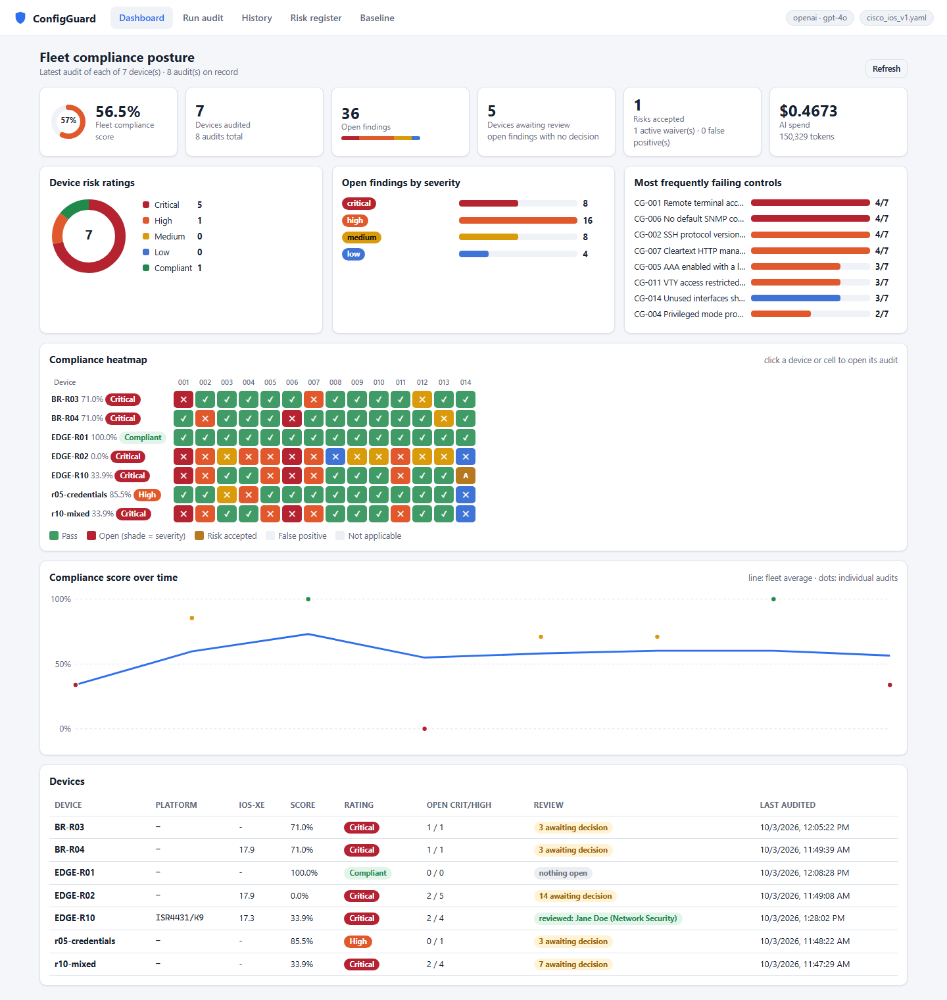
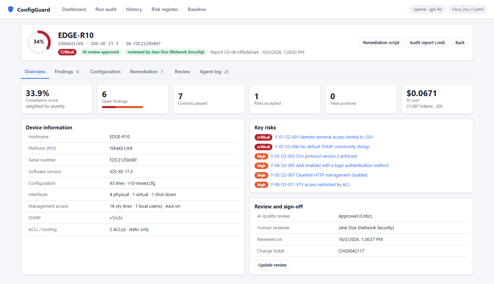
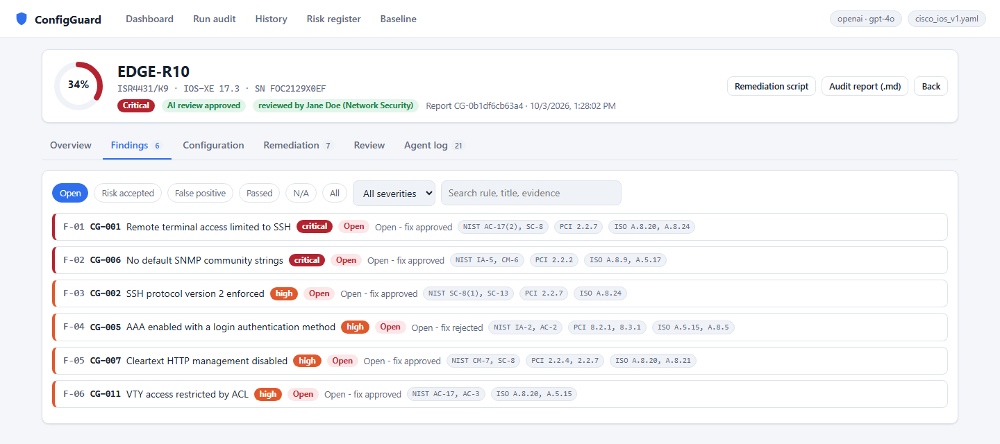
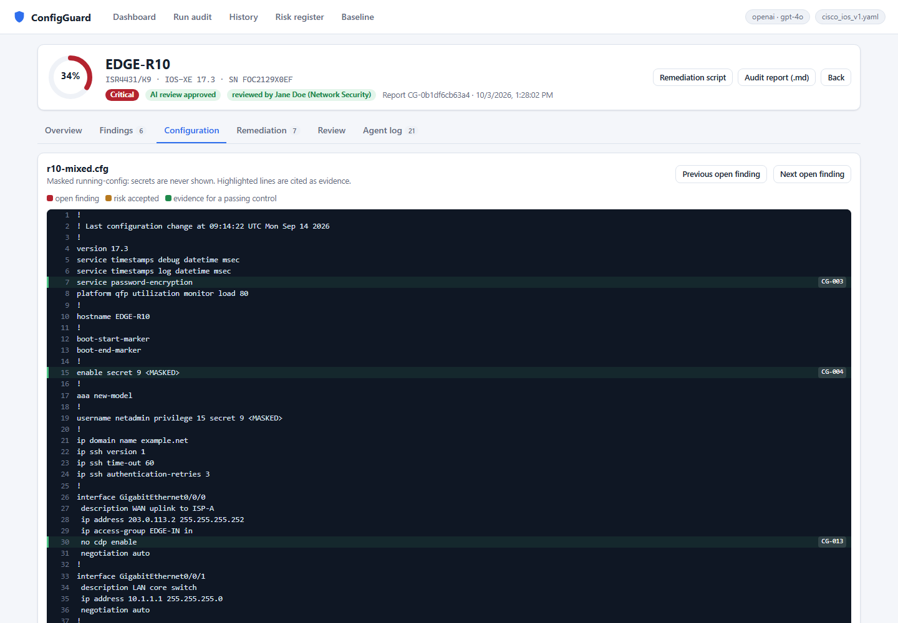
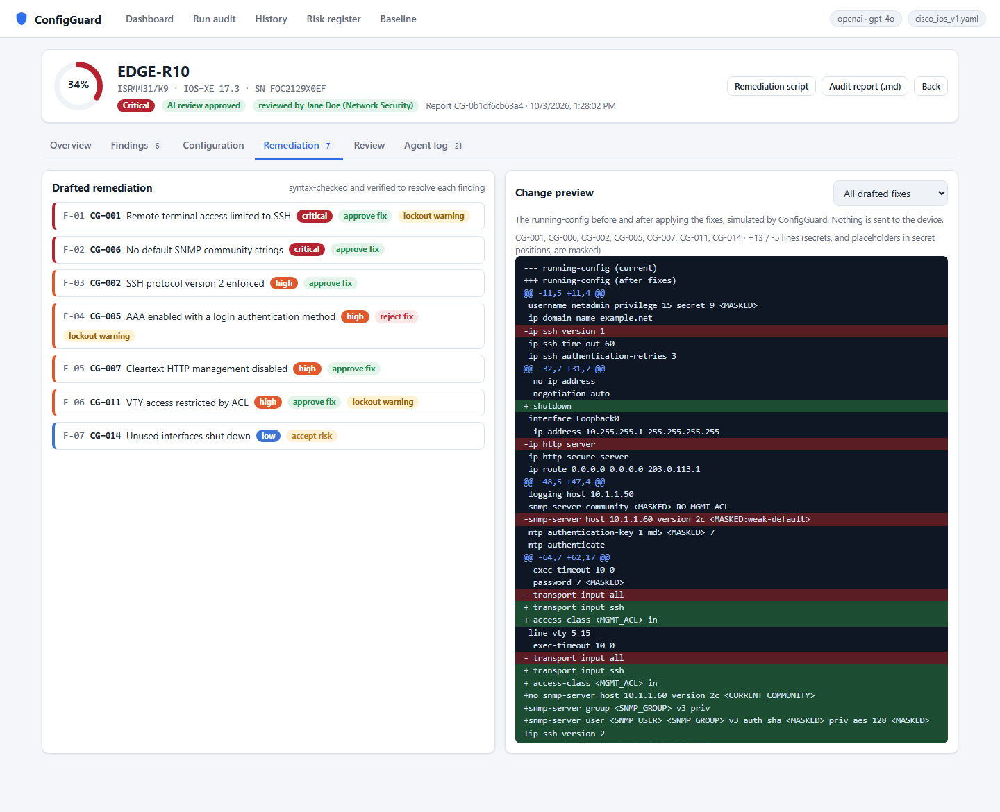
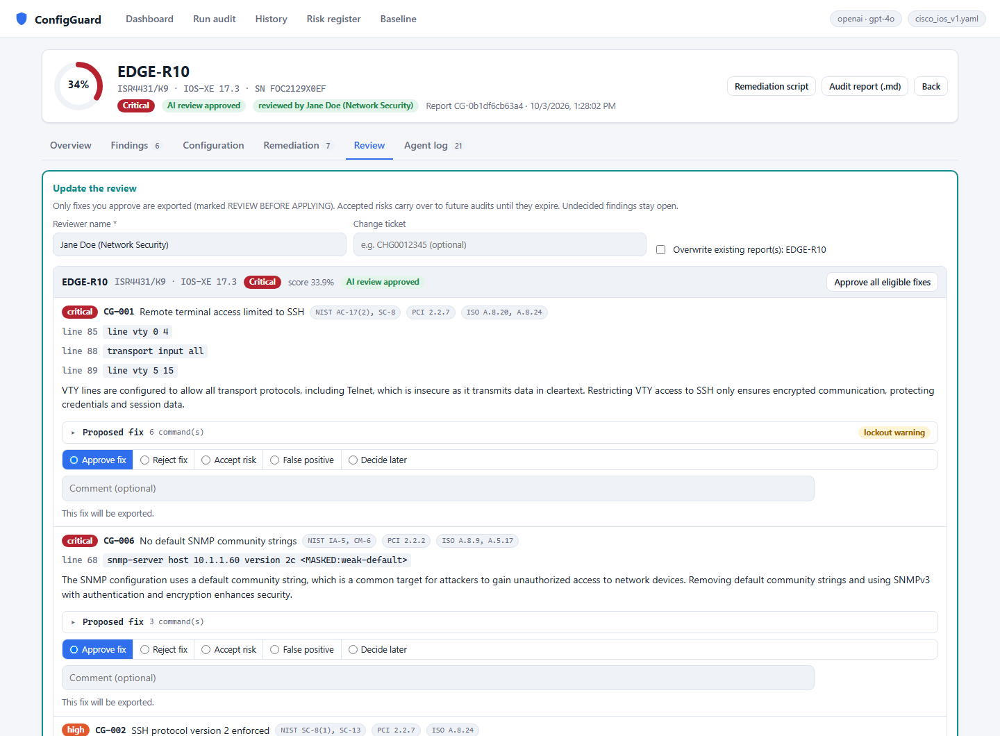
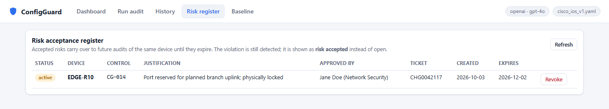
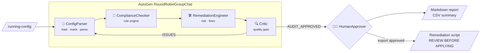
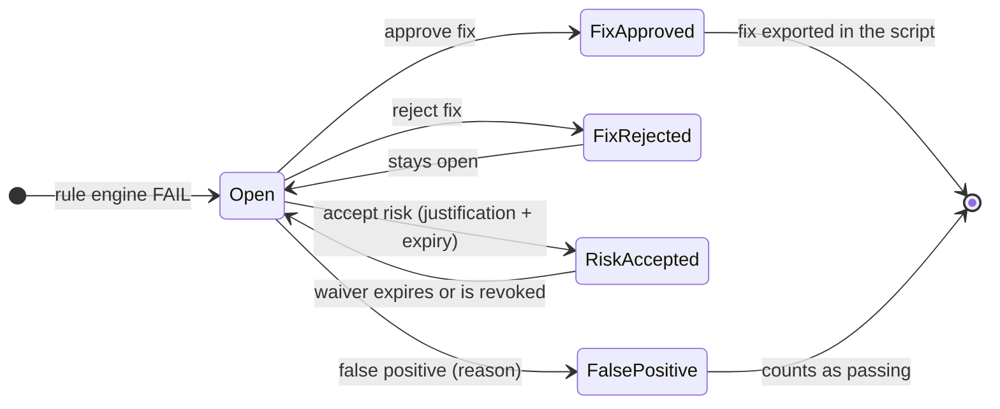

<div align="center">

# 🛡️ ConfigGuard

**Multi-agent security compliance auditing for Cisco IOS / IOS-XE configurations**

Built with [Microsoft AutoGen](https://github.com/microsoft/autogen) AgentChat · deterministic rule engine · human in the loop


[](LICENSE)

</div>

---

ConfigGuard reads network device running configs, checks them against a YAML security baseline,
**cites the exact config line behind every finding**, explains each risk in plain language for
auditors, and drafts IOS remediation for engineers to review.

> **It never pushes changes to a device.** Every remediation is a reviewed draft, gated by a human.

## Contents

- [What's new](#whats-new)
- [Why ConfigGuard](#why-configguard)
- [Highlights](#highlights)
- [Screenshots](#screenshots)
- [How it works](#how-it-works)
- [Meet the agents](#meet-the-agents)
- [Results](#results)
- [Quick start](#quick-start)
- [Web UI](#web-ui)
- [Human review and risk acceptance](#human-review-and-risk-acceptance)
- [Scores and ratings](#scores-and-ratings)
- [Command line](#command-line)
- [Configuration](#configuration)
- [Outputs](#outputs)
- [Sample output](#sample-output)
- [The baseline](#the-baseline)
- [Security and safeguards](#security-and-safeguards)
- [Testing](#testing)
- [Project structure](#project-structure)
- [Troubleshooting](#troubleshooting)
- [Known limitations](#known-limitations)
- [Roadmap](#roadmap)
- [License](#license)

## What's new

**Dashboards, audit-grade reports and per-finding human sign-off**

- 📊 **Fleet dashboard:** compliance score and risk rating per device, a device × control heatmap,
  most frequently failing controls, open findings by severity, a score trend and AI spend.
- 🔎 **Audit detail page:** device facts, a filterable findings list, a masked config viewer with
  evidence lines highlighted, and a before/after change preview of the proposed fixes.
- 🧑‍⚖️ **Per-finding review:** approve the fix, reject it, accept the risk until a date, or mark a
  false positive. Each decision records reviewer, time and change ticket. Only approved fixes are
  exported.
- 📋 **Risk-acceptance register:** accepted risks carry over to future audits and reopen when they
  expire.
- 📄 **Professional report layout:** executive summary, scope and device facts, findings register
  with NIST SP 800-53 / PCI DSS v4.0 / ISO 27001:2022 control IDs, risk register and sign-off.

<details>
<summary><b>Earlier milestones</b></summary>

- **Safeguards and token savings:** hard caps on tokens, time and reply length; ReDoS-safe search;
  bounded remediation inputs; about 20% fewer tokens with no loss of accuracy.
- **Local web UI:** live agent timeline over WebSockets, history with replay, baseline viewer.
- **Core engine:** four AutoGen agents, a deterministic rule engine, secret masking, verified
  remediation, pause/resume, batch mode and an independent ground-truth test set.
</details>

## Why ConfigGuard

Network configurations drift away from security baselines over time. Manual audits across many
devices are slow, inconsistent, and hard to evidence. Asking an LLM to "review this config" is fast
but untrustworthy: it can miss violations, invent ones that aren't there, and see every password
in the file.

ConfigGuard combines the two approaches. **Code decides what is compliant; agents explain it and
fix it; a human approves.**

| Audience | What they get |
|---|---|
| **Network and security engineers** | Exact evidence lines, verified IOS remediation scripts, lockout warnings |
| **Compliance auditors** | A plain-language "what this means" summary for every failed control |
| **Teams running many devices** | Batch audits, a CSV summary, a full audit trail, token and cost tracking |

## Highlights

- 🎯 **No made-up findings.** Verdicts come from a deterministic rule engine. A FAIL can't exist
  without a cited config line or a "required line is missing" statement.
- 🔒 **Secrets never reach the model.** Passwords, keys and SNMP communities are masked before any
  text leaves a tool, and default communities show as `<MASKED:weak-default>`.
- ✅ **Remediation is checked, not trusted.** Every fix is syntax-checked, then applied to an
  in-memory copy of the config, and the rule is re-run to prove the fix resolves the finding.
- ⚠️ **Lockout-aware.** Changes that could cut off management access (vty transport, ACLs, AAA)
  must carry a `LOCKOUT WARNING` that names a recovery path.
- 🧑‍⚖️ **Per-finding human sign-off.** For every failed control the reviewer approves the fix, rejects
  it, accepts the risk (with justification and expiry), or marks a false positive. Each decision
  records reviewer, time and change ticket, and **only approved fixes are exported**.
- 📋 **Risk-acceptance register.** Accepted risks carry over to future audits of the same device
  until they expire. The violation is still detected but shown as *risk accepted*, and it reopens
  automatically when the waiver expires.
- 📊 **Fleet dashboard.** Compliance score and risk rating per device, open findings by severity,
  the most frequently failing controls, a device × control heatmap, and a score trend over time.
- 📄 **Audit-grade reports.** Executive summary, device facts (platform, IOS-XE version, serial),
  findings register with NIST SP 800-53 / PCI DSS v4.0 / ISO 27001:2022 control IDs, detailed
  findings, risk register and reviewer sign-off.
- 👀 **Watch the agents work.** A local web UI streams every agent message and tool call live,
  with a masked config viewer, a before/after change preview, and full history and replay.
- 💸 **Spend-safe.** Hard caps on tokens, time and reply length for every audit. Each run logs
  its tokens and cost.
- ⏸️ **Pause and resume.** Audits are checkpointed and can be resumed. A checkpoint refuses to resume
  against a config that has changed.
- 🔌 **Model-agnostic.** OpenAI by default. Switch to Anthropic or Ollama with one setting.

## Screenshots

> Captured from the local UI auditing the synthetic test configs in `tests/fixtures/`. The reviewer
> name is demo data, and all configuration text is masked.

**Fleet dashboard:** posture across the latest audit of every device, with a clickable heatmap.



<table>
<tr>
<td width="50%"><b>Audit overview</b>: score, device facts, key risks, sign-off<br></td>
<td width="50%"><b>Findings</b>: F-numbered, filterable, with framework control IDs<br></td>
</tr>
<tr>
<td><b>Configuration viewer</b>: masked running-config, evidence highlighted by status<br></td>
<td><b>Remediation</b>: drafted fixes with decisions, and a before/after change preview<br></td>
</tr>
<tr>
<td><b>Human review</b>: a decision per failed control, with evidence, risk and proposed fix<br></td>
<td><b>Risk register</b>: accepted risks with approver, ticket and expiry<br></td>
</tr>
</table>

## How it works



1. **Parse.** The config is loaded and every secret is masked. `ciscoconfparse2` builds a
   structured inventory. The LLM never parses raw configs itself.
2. **Check.** Each of the 14 baseline rules is evaluated **in code**. Each finding records its
   status, severity, evidence lines and line numbers.
3. **Remediate.** For each FAIL, an agent explains the risk in plain language and drafts IOS
   commands. The fix is rejected unless it passes syntax and mode checks **and** actually resolves
   the finding when re-checked against a patched copy of the config.
4. **Review.** The Critic checks the recorded results (not chat claims) for completeness, evidence
   and safety, then approves or sends work back.
5. **Sign off.** You decide on every failed control: approve the fix, reject it, accept the risk
   until a date, or mark a false positive. Only approved fixes go into the remediation script.
   Accepted risks go into the risk register (`waivers.yaml`). Reports are built from the recorded
   data, never from what the agents said in chat.

> **Design rule:** the LLM never decides a verdict and never sees a secret. See
> [docs/ARCHITECTURE.md](docs/ARCHITECTURE.md) for the full design.

## Meet the agents

| Agent | Job | Tools | What it must never do |
|---|---|---|---|
| 🧩 **ConfigParser** | Load the config, mask secrets, build the inventory | `load_config`, `mask_secrets`, `parse_ios_config` | Judge compliance or repeat raw config text |
| 📏 **ComplianceChecker** | Evaluate every rule and report the failures with evidence | `load_baseline`, `check_rule`, `find_config_lines` | Change a verdict, or report a FAIL without evidence |
| 🛠️ **RemediationEngineer** | Explain each risk and draft verified IOS fixes | `get_fail_findings`, `validate_ios_syntax`, `record_remediation` | Use real secrets, or risk a lockout without a warning |
| 🔍 **Critic** | Review the recorded audit; approve or send it back | `get_audit_record` (read-only) | Fix anything or change verdicts |
| 🧑‍⚖️ **HumanApprover** | Final gate before exporting or overwriting | AutoGen `UserProxyAgent` | — |

Only the Critic can end a run, so an `AUDIT_APPROVED` string planted in a config can't stop an
audit early.

## Results

Measured on 10 synthetic IOS-XE configs with **39 seeded violations** (`tests/fixtures/`), using gpt-4o:

| Success criterion | Result |
|---|---|
| Detects 100% of seeded violations | ✅ **140/140** verdicts correct (39/39 violations found) |
| Zero hallucinated violations | ✅ **0** false positives; every evidence line verified against the file |
| Every remediation is valid IOS | ✅ All pass syntax and mode checks, and resolve their finding when re-checked |
| One audit in under 90 seconds | ✅ **13–58 s** per audit (typically 14–28 s) |

**Typical cost:** about **$0.03–0.08 per device** with gpt-4o (9k–29k tokens). A full 10-device
run costs about $0.47. The token optimisations cut usage by 19% and cost by 21% with no loss of
accuracy.

## Quick start

**Prerequisites:** Python 3.11+, [uv](https://docs.astral.sh/uv/) (or pip), and an OpenAI API key.

```bash
git clone https://github.com/natrajexplore/AutoGen_Agentic-AI.git
cd AutoGen_Agentic-AI
uv sync                                   # installs pinned dependencies
cp .env.example .env                      # then set OPENAI_API_KEY in .env

uv run configguard ui                     # open http://127.0.0.1:8000 and run an audit
# or, in the terminal:
uv run configguard audit tests/fixtures/r10-mixed.cfg
```

<details>
<summary><b>Using pip instead of uv</b></summary>

```bash
python -m venv .venv
.venv\Scripts\activate          # Windows  (source .venv/bin/activate on macOS/Linux)
pip install -r requirements.txt
pip install -e .
configguard ui
```
</details>

<details>
<summary><b>Optional: AutoGen source as a read-only reference</b></summary>

AutoGen is installed from PyPI with pinned versions. Its source is handy for checking APIs:

```bash
git clone --depth 1 https://github.com/microsoft/autogen.git ./reference/autogen
```

`reference/` is gitignored. Useful paths: `python/packages/autogen-agentchat/src/autogen_agentchat/`
(agents, teams, conditions, ui) and `python/samples/`. AutoGen is in maintenance mode, with
Microsoft Agent Framework as its successor. ConfigGuard keeps AutoGen confined to four files so it
can be ported later (see *Portability* in the architecture doc).
</details>

## Web UI

```bash
uv run configguard ui            # http://127.0.0.1:8000   (--port to change)
```

```
┌ 🛡️ ConfigGuard     Run · History · Baseline                 openai · gpt-4o ┐
├───────────────┬──────────────────────────────────────────────────────────────┤
│ Configs       │ ● Parser ✓ → ● Checker ✓ → ◌ Remediation … → ○ Critic → ○ You │
│ ☑ r10-mixed   │──────────────────────────────────────────────────────────────│
│ ☐ r02-all     │ ComplianceChecker  requests 14 tool calls                    │
│ ☐ r09-bait    │   ▸ check_rule  {"rule_id":"CG-001"}            [FAIL]       │
│ [Upload]      │   ▸ check_rule  {"rule_id":"CG-003"}            [PASS]       │
│ [Run audit]   │ RemediationEngineer → record_remediation ▸   [recorded]      │
├───────────────┴──────────────────────────────────────────────────────────────┤
│ Findings: 7 FAIL · 7 PASS          [Export selected]  [Export none]          │
└──────────────────────────────────────────────────────────────────────────────┘
```

| Tab | What you can do |
|---|---|
| **Dashboard** | Fleet posture across the latest audit of each device: fleet compliance score, devices awaiting review, open findings by severity, risk ratings, most frequently failing controls, a device × control **heatmap** (click any cell to open that finding), the score trend, and AI spend. |
| **Run audit** | Pick or upload configs and watch each agent's messages and tool calls stream live. When the agents finish, the **review form** lists every failed control with its evidence, risk and proposed fix: approve, reject, accept the risk (with expiry), or mark a false positive. |
| **History** | Every past audit with score, rating, AI review and human review status. |
| **Audit detail** | *Overview* (score gauge, device facts, key risks, sign-off) · *Findings* (filter by status, severity or text, with framework IDs) · *Configuration* (masked running-config with evidence lines highlighted; jump between open findings) · *Remediation* (drafted fixes plus a before/after **change preview**) · *Review* (decide or update decisions after the fact) · *Agent log* (full replay). Deep links: `#audit/<id>/<tab>`. |
| **Risk register** | All accepted risks with justification, approver, ticket and expiry, plus warnings for waivers expiring soon. Revoke a waiver with an inline confirmation. |
| **Baseline** | The 14 rules with severity, framework mappings, check definition and remediation hint. |

The UI is **local-only by design**. It listens on `127.0.0.1`, rejects other Host headers (DNS
rebinding) and cross-origin requests, so other web pages can't drive it or spend your API credits.
Closing the tab mid-audit saves the audit as paused.

## Human review and risk acceptance

Every failed control gets an explicit human decision, as in a real audit sign-off. The rule
engine's verdict never changes; the decision changes what happens next.



| Decision | Exported in script? | Compliance score | Open finding? | Carries over to future audits? | Required |
|---|---|---|---|---|---|
| **Approve fix** | ✅ yes | counts as failing until applied | yes (*fix approved*) | no | AI-approved audit with a verified fix |
| **Reject fix** | no | failing | yes (*fix rejected*) | no | optional comment |
| **Accept risk** | no | still failing (non-compliant) | **no** | ✅ until expiry, via `waivers.yaml` | justification (10+ chars), expiry ≤ `MAX_WAIVER_DAYS` |
| **False positive** | no | counts as passing | **no** | no | reason (10+ chars) |
| *Decide later* | no | failing | yes (*pending review*) | no | — |

Every decision records the **reviewer, timestamp, comment and change ticket**. It appears in the
report's findings register and sign-off section, in the CSV, in the History tab, and in
`logs/<audit_id>.jsonl`. All rules are enforced **on the server** (`approval.validate_review`),
whether the review comes from the terminal, a live run in the UI, or the History tab after the fact.

**How waivers behave:** in later audits of the same device the violation is still detected, but it
shows as *risk accepted*, the agents skip drafting a fix for it (saving tokens), and it **reopens
automatically** when the waiver expires. Manage waivers in the **Risk register** tab.

## Scores and ratings

| | How it's calculated |
|---|---|
| **Compliance score** | Weighted share of applicable controls that pass: critical **10**, high **5**, medium **3**, low **1**. Not-applicable controls are excluded. A false positive counts as passing; an accepted risk still counts as failing. |
| **Risk rating** | Severity of the worst **open** finding: *Critical*, *High*, *Medium*, *Low*, or *Compliant* when nothing is open. Accepted risks and false positives are not open. |
| **Fleet score** | Average score across the latest audit of each device. |

*Example:* a device failing one critical, one high and one medium control out of all 14 scores
`(62 − 18) / 62 = 71.0%` and is rated **Critical**. Accepting the risk on the medium finding leaves
the score at 71.0% (still non-compliant) but removes it from the open findings.

## Command line

```bash
uv run configguard audit  tests/fixtures/r10-mixed.cfg       # one device, streams the agents
uv run configguard batch  tests/fixtures                     # every *.cfg in a folder, one review step
uv run configguard batch  ./configs --pattern "*.txt"        # custom file pattern
uv run configguard resume 5f5d60172f2e                       # continue a paused / unapproved audit
uv run configguard ui     --port 8000                        # local web UI
python main.py audit tests/fixtures/r10-mixed.cfg            # same as `configguard`
```

| Option | Applies to | Effect |
|---|---|---|
| `--baseline PATH` | all (before the subcommand) | Use a different baseline YAML |
| `--no-remediation-export` | all (before the subcommand) | Reports only; fixes can't be approved for export |
| `--reviewer NAME` | all (before the subcommand) | Reviewer recorded with each decision |
| `--quiet` | `audit`, `resume` | Don't stream the agent conversation |
| `--stream` | `batch` | Stream each audit's conversation |
| `--pattern GLOB` | `batch` | File pattern (default `*.cfg`) |
| `--port N` | `ui` | Port for the web UI (default 8000) |

**Human review in the terminal:** after the audits, ConfigGuard asks for your name (or uses
`--reviewer` / `REVIEWER_NAME`) and an optional change ticket. It then walks through each failed
control: `[a]pprove fix / [r]eject fix / [w] accept risk / [f]alse positive / [s]kip`, or `[A]` to
approve all remaining fixes. Risk acceptance asks for a justification and an expiry date (default
90 days). Anything you skip stays open, and nothing is exported for it.

**Pause and resume:** press **Ctrl+C** during an audit to save it to `state/<audit_id>.json`. An
audit that ends without approval is saved the same way. Run `configguard resume <audit_id>` to
continue.

**Exit codes:** `0` all approved · `2` any audit not approved or failed · `130` interrupted (state saved) · `1` usage error.

## Configuration

All settings live in `.env` (copy from [`.env.example`](.env.example)). Only the API key is required.

| Variable | Default | Purpose |
|---|---|---|
| `OPENAI_API_KEY` | — | Required for `MODEL_PROVIDER=openai` |
| `MODEL_PROVIDER` | `openai` | `openai`, `anthropic` or `ollama` |
| `MODEL` | `gpt-4o` | Model name for the chosen provider |
| `ANTHROPIC_API_KEY` / `OLLAMA_HOST` | — / `http://localhost:11434` | For the other providers |
| `PRICE_INPUT_PER_MTOK` / `PRICE_OUTPUT_PER_MTOK` | `2.50` / `10.00` | USD per 1M tokens, for cost tracking |
| `MAX_TOKENS_PER_AUDIT` | `150000` | Hard token cap per audit |
| `AUDIT_TIMEOUT_S` | `300` | Hard time cap per audit |
| `MAX_REPLY_TOKENS` | `2048` | Cap on each model reply |
| `REQUEST_TIMEOUT_S` | `60` | Timeout per API request (2 retries) |
| `MAX_MESSAGES` | `25` | Message cap per audit |
| `REVIEWER_NAME` | — | Default reviewer for terminal reviews (asked for if empty) |
| `MAX_WAIVER_DAYS` | `365` | Longest allowed risk acceptance |
| `WAIVERS_PATH` | `waivers.yaml` | Risk-acceptance register (gitignored by default) |
| `BASELINE_PATH` | `baselines/cisco_ios_v1.yaml` | Baseline file |
| `CONFIGS_DIR` / `UPLOADS_DIR` | `tests/fixtures` / `uploads` | Configs offered in the web UI |
| `REPORTS_DIR` · `REMEDIATION_DIR` · `LOGS_DIR` · `STATE_DIR` | `reports` · `remediation` · `logs` · `state` | Output folders |

> **Switching models:** Anthropic and Ollama also need `uv add "autogen-ext[anthropic]==0.7.5"` or
> `"autogen-ext[ollama]==0.7.5"`. An Ollama model must support tool calling. Update the price
> settings to match.

## Outputs

| Path | Contents |
|---|---|
| `reports/<device>.md` | Audit report: executive summary, scope and device facts, findings register with framework IDs, detailed findings, compliant controls, risk register, reviewer sign-off, audit trail |
| `reports/summary-<timestamp>.csv` | `device, rule_id, severity, status, evidence, review_status, reviewer, ticket, frameworks` for every rule on every device |
| `reports/batch-summary-<timestamp>.md` | Batch table (also printed) |
| `remediation/<device>_<audit_id>_remediation.txt` | **Only the fixes the reviewer approved**, headed **REVIEW BEFORE APPLYING** with approver and change ticket |
| `waivers.yaml` | Risk-acceptance register: device, control, justification, approver, ticket, expiry |
| `logs/<audit_id>.jsonl` | Every agent message, tool call and result, the human review, tokens and cost |
| `state/<audit_id>.json` | Checkpoint for resume (contains no config text) |

ConfigGuard asks before overwriting an existing report. If you decline, the new report is written
next to the old one. Remediation script names include the audit ID, so scripts never overwrite
each other.

## Sample output

<details open>
<summary><b>Batch run</b></summary>

```text
[1/3] auditing r01-compliant.cfg ...
    approved: FAIL 0 PASS 14 N/A 0 (12s, $0.0390)
[2/3] auditing r02-all-violations.cfg ...
    approved: FAIL 14 PASS 0 N/A 0 (31s, $0.0870)
[3/3] auditing r04-snmp-ssh-cdp.cfg ...
    approved: FAIL 3 PASS 11 N/A 0 (18s, $0.0542)

========================================================================
HUMAN REVIEW
========================================================================
 1. EDGE-R01             FAIL  0  PASS 14  N/A  0  [approved]
 2. EDGE-R02             FAIL 14  PASS  0  N/A  0  [approved]
      CG-001: 3 command(s)  LOCKOUT WARNING
      ...
 3. BR-R04               FAIL  3  PASS 11  N/A  0  [approved]

Export remediation scripts (marked "REVIEW BEFORE APPLYING")?
Eligible: 2=EDGE-R02, 3=BR-R04
> all

| Device | Approved | PASS | FAIL | N/A | Critical/High FAIL | Time | Tokens | Cost |
|---|---|---|---|---|---|---|---|---|
| EDGE-R01 | yes | 14 | 0 | 0 | 0 | 12s | 12,418 | $0.0390 |
| EDGE-R02 | yes | 0 | 14 | 0 | 7 | 31s | 27,067 | $0.0870 |
| BR-R04 | yes | 11 | 3 | 0 | 2 | 18s | 17,584 | $0.0542 |
| **Total (3)** | | | | | | | 57,069 | $0.1802 |
```
</details>

<details>
<summary><b>Report excerpt</b> (<code>reports/EDGE-R10.md</code>)</summary>

```markdown
# Network Device Security Compliance Audit Report

| | |
|---|---|
| Device | **EDGE-R10** · ISR4431/K9 · IOS-XE 17.3 |
| Report ID | `CG-0b1df6cb63a4` |
| Reviewed by | Jane Doe · ticket `CHG0042117` |

## 1. Executive summary

**Compliance score: 33.9%** · **Risk rating: Critical** · AI quality review: approved

## 3. Findings register

| ID | Control | Title | Severity | Status | Frameworks |
|---|---|---|---|---|---|
| F-01 | CG-001 | Remote terminal access limited to SSH | Critical | Open - fix approved | NIST AC-17(2), SC-8; PCI 2.2.7; ISO/IEC A.8.20, A.8.24 |
| F-04 | CG-005 | AAA enabled with a login authentication method | High | Open - fix rejected | NIST IA-2, AC-2; PCI 8.2.1, 8.3.1; ISO/IEC A.5.15, A.8.5 |
| F-07 | CG-014 | Unused interfaces shut down | Low | Risk accepted until 2026-12-02 | NIST CM-7; ISO/IEC A.8.20 |
```
</details>

<details>
<summary><b>Remediation script excerpt</b></summary>

```text
!========================================================================
! REVIEW BEFORE APPLYING
! ConfigGuard draft remediation. NOT applied to any device.
! Apply in global configuration mode (configure terminal), in a maintenance window,
! with console or out-of-band access available. Replace every <PLACEHOLDER> first.
!========================================================================
!
! LOCKOUT WARNINGS
!   CG-001: LOCKOUT WARNING: Ensure a console session is active before applying ...
!
! --- CG-006 No default SNMP community strings [critical]
snmp-server group <SNMP_GROUP> v3 priv
snmp-server user <SNMP_USER> <SNMP_GROUP> v3 auth sha <AUTH_SECRET> priv aes 128 <PRIV_SECRET>
no snmp-server host 10.1.1.60 version 2c <CURRENT_COMMUNITY>
```
</details>

## The baseline

[`baselines/cisco_ios_v1.yaml`](baselines/cisco_ios_v1.yaml) contains 14 rules written in
ConfigGuard's own wording, informed by public Cisco hardening guidance:

| Rule | Control | Severity |
|---|---|---|
| CG-001 | Remote terminal access limited to SSH (no Telnet on vty) | 🔴 critical |
| CG-002 | SSH protocol version 2 enforced | 🟠 high |
| CG-003 | Password encryption service enabled | 🟡 medium |
| CG-004 | Privileged mode protected by `enable secret`, not `enable password` | 🟠 high |
| CG-005 | AAA enabled with a login authentication method | 🟠 high |
| CG-006 | No default SNMP community strings (SNMPv3 preferred) | 🔴 critical |
| CG-007 | Cleartext HTTP management disabled | 🟠 high |
| CG-008 | Login banner configured | ⚪ low |
| CG-009 | Remote syslog with informational logging | 🟡 medium |
| CG-010 | Authenticated NTP | 🟡 medium |
| CG-011 | VTY access restricted by ACL | 🟠 high |
| CG-012 | Idle session timeout on console and vty | 🟡 medium |
| CG-013 | CDP disabled on external-facing interfaces | 🟡 medium |
| CG-014 | Unused interfaces shut down | ⚪ low |

**Adding a rule** takes a few lines of YAML, using one of four check types (`global_required`,
`global_forbidden`, `children_required`, `python`):

```yaml
- id: CG-015
  title: Domain lookup disabled
  severity: low
  category: hardening
  description: Disable DNS lookups so mistyped commands are not broadcast as hostnames.
  check:
    type: global_required
    all_of: ['^no ip domain[- ]lookup$']
  remediation_hint: [no ip domain lookup]
```

The baseline is validated when it is loaded. Two conventions you may need to adapt:
- **External interfaces (CG-013):** interfaces whose `description` matches `settings.external_interface_pattern`.
- **Unused interfaces (CG-014):** no IP, no description, no switchport or channel-group config, and not `shutdown`.

## Security and safeguards

| Risk | How ConfigGuard handles it |
|---|---|
| **Secrets leaking to the model** | Raw config text stays in memory and is never returned by a tool. All tool output is masked: enable/user/line secrets, type-7 passwords, SNMP communities and v3 keys, NTP/TACACS/RADIUS/ISAKMP/OSPF/BGP/HSRP/VRRP keys, Wi-Fi PSKs and more. The search tool runs on masked text, so the model can't probe for secret values. A test checks that no fixture secret appears in any tool output. |
| **Prompt injection via config text** | Verdicts are decided in code, so injected text can't change them. Free text is truncated and labelled untrusted. Only the Critic can end a run. The test set includes a config (r09) with a live injection payload. |
| **Unsafe remediation** | Destructive or exec-mode commands (`reload`, `write`, `copy`, `erase`, ...) are rejected. Secrets must be placeholders. Lockout risks need a warning. Scripts are written only after human approval, and nothing is ever pushed to a device. |
| **Script or report injection** | Control characters are stripped from agent text, so a newline can't turn a script comment into a command. Report text is HTML-escaped, and CSV cells are protected against formula injection. |
| **Runaway cost** | Each audit stops at the first of: approval, 25 messages, 150k tokens, or 300 s. Replies are capped at 2,048 tokens, and requests time out after 60 s. |
| **Malicious regex patterns** | The `regex` engine runs model-supplied patterns with a 1-second budget for the whole search. |
| **Web UI abuse** | Localhost only, Host and Origin checks, no client-supplied file paths, sanitised uploads, and approvals accepted only while a question is open. |
| **Unsafe or forged approvals** | Every decision is validated on the server: only FAIL findings can be decided, fixes only for AI-approved audits with a verified remediation, justifications required for accepted risks and false positives, expiry capped at `MAX_WAIVER_DAYS`, ticket format checked, reviewer text sanitised. The browser's checks are never trusted. |
| **Code execution** | No agent executes code, so no executor is configured. |

## Testing

```bash
uv run pytest                    # 323 offline tests, no API calls (about 8 s)
uv run pytest -m llm -s          # live run on all 10 fixtures (about 4 min, about $0.47 with gpt-4o)
uv run python tests/fixtures/generate_fixtures.py   # regenerate fixtures and expected_results.json
```

- **Independent ground truth.** `expected_results.json` comes from the violations *seeded* by the
  fixture generator, not from ConfigGuard output.
- **Coverage.** The fixtures include a fully compliant config (r01), one with all 14 violations (r02),
  NOT_APPLICABLE cases (r08) and a prompt-injection bait config (r09).
- **Licensing is tested too.** The LICENSE text must match the canonical GPL-3.0, every source file
  must carry its SPDX header, and every pinned dependency must appear in the third-party notices.
- **What's tested.** Every tool, the rule engine's edge cases, masking (including leak tests), the
  remediation patcher, reports, per-finding review validation, scoring, waivers, device facts,
  checkpoints, the web backend and dashboard (with a fake agent run) and the spend safeguards.

## Project structure

```
AutoGen_Agentic-AI/
├── main.py                       # entry point (same as `configguard`)
├── LICENSE                       # GNU GPL v3 (project licensed GPL-3.0-or-later)
├── THIRD_PARTY_NOTICES.md        # dependency licenses and referenced standards
├── baselines/cisco_ios_v1.yaml   # the 14 baseline rules
├── docs/
│   ├── ARCHITECTURE.md           # design, Mermaid flow, schema, security model
│   └── SPEC.md                   # original project brief
├── src/configguard/
│   ├── cli.py · runner.py        # CLI; single, batch and resume orchestration
│   ├── team.py                   # RoundRobinGroupChat, termination, spend caps
│   ├── agents/factory.py         # the four AssistantAgents and their tool bindings
│   ├── approval.py               # HumanApprover (UserProxyAgent): per-finding review + validation
│   ├── scoring.py · facts.py     # compliance score / risk rating, device facts
│   ├── waivers.py                # risk-acceptance register (waivers.yaml)
│   ├── prompts.py                # agent system messages
│   ├── tools/                    # framework-agnostic tools (no AutoGen imports)
│   │   ├── loader.py · masking.py · parser.py
│   │   ├── baseline.py · rule_checks.py        # deterministic rule engine
│   │   ├── ios_syntax.py · simulate.py         # remediation validation and verification
│   │   └── audit_record.py                     # read-only views for agents
│   ├── web/                      # FastAPI backend (app, history, dashboard) + static UI
│   ├── reporting.py              # Markdown, CSV, remediation scripts
│   ├── telemetry.py              # JSONL logging, token and cost tracking
│   ├── persistence.py            # pause/resume checkpoints
│   └── config/                   # settings (.env) and model client factory
└── tests/                        # unit, accuracy, web and safeguard tests + fixtures
```

**Tech stack:** Python 3.11 · AutoGen AgentChat / autogen-ext 0.7.5 · ciscoconfparse2 · Pydantic ·
FastAPI + uvicorn + WebSockets · vanilla JS · pytest · uv

## Troubleshooting

<details>
<summary><b>"No API key configured" in the UI, or authentication errors</b></summary>

Set `OPENAI_API_KEY` in `.env` (not `.env.example`) and restart `configguard ui`. For other
providers, set `MODEL_PROVIDER` and that provider's key.
</details>

<details>
<summary><b>The UI won't start: port already in use</b></summary>

Run `uv run configguard ui --port 8765`, or stop the other process using port 8000.
</details>

<details>
<summary><b>An audit ended "NOT approved"</b></summary>

It hit a limit (messages, tokens or time), or the Critic raised issues that weren't resolved. The
audit is checkpointed. Continue with `configguard resume <audit_id>`, or use **Resume** in the
History tab. The reason is printed and recorded in `logs/<audit_id>.jsonl`.
</details>

<details>
<summary><b>My own configs don't appear in the UI</b></summary>

Upload them with the **Upload** button, or set `CONFIGS_DIR` in `.env` to your config folder.
Files must end in `.cfg`, `.txt`, `.conf` or `.ios`.
</details>

<details>
<summary><b>Resume says the config "changed on disk"</b></summary>

This is intentional: a checkpoint only resumes against the exact file it started with. Start a
new audit for the updated config.
</details>

## Known limitations

- **The syntax validator is best-effort.** It knows command keywords, mode order and the argument
  shapes this baseline needs. It is not a full IOS parser, and it accepts any command inside
  `router`, `key chain` or `tacacs server` blocks.
- **Remediation verification is an approximation.** The patcher models IOS merge behaviour well
  enough for these rules, but it isn't an emulator. Validate fixes in a lab before production.
- **"Intent" relies on the Critic.** Code proves that a fix makes the rule pass, not that it does
  so the intended way. In testing the Critic approved almost everything, so **human review is
  required, not optional.**
- **Remediation can be redundant.** For example, it may re-add `aaa new-model` when it already
  exists, or create a placeholder ACL instead of reusing an existing one.
- **Interface classification depends on descriptions** (CG-013), and line numbers assume
  `show running-config` formatting.
- **Batch audits run one at a time.** That avoids rate limits, but takes roughly 15–30 s per device.
- **Framework mappings are best-effort.** The NIST / PCI / ISO control IDs were written for
  ConfigGuard and have not been reviewed by an assessor. Verify them before relying on them.
- **Device identity is the hostname.** Waivers and the dashboard key devices by hostname, so two
  devices sharing a hostname are treated as one.
- **Ctrl+C pause is untested.** Resume after an early stop is tested live. Saving mid-run on
  Ctrl+C has no automated test yet.

## Roadmap

**v2: Cisco ASA and Palo Alto PAN-OS.** The design already isolates what changes per platform:

1. **Parsers:** ASA via `ciscoconfparse2` (`syntax="asa"`). PAN-OS XML into the same masked
   inventory shape.
2. **Baselines:** one per platform, plus new XML check types (`xpath_required`, rule-table checks
   such as "no any/any allow rules").
3. **Masking:** ASA and PAN-OS secret patterns (`<phash>`, `<key>`, API keys), each with leak tests.
4. **Remediation:** an ASA validator variant, plus PAN-OS `set` commands or XML API patches.
5. **Routing:** detect the platform from the file and pick the parser, baseline and validator.
   The agents and prompts stay the same.

**Also planned:**
- Further token savings: skip the ConfigParser's reflection call, and cap how much history each
  agent re-reads.
- A stronger model, or an independent second-opinion check, for the Critic.
- Verify that access-class ACLs are defined and non-empty.
- Concurrent batch audits with a rate-limit budget.
- Optional lab verification of remediation (pyATS / Batfish).

## License

Copyright (C) 2026 Nataraj Angappan

ConfigGuard is free software: you can redistribute it and/or modify it under the terms of the
**GNU General Public License** as published by the Free Software Foundation, either **version 3** of
the License, or (at your option) any later version.

ConfigGuard is distributed in the hope that it will be useful, but **WITHOUT ANY WARRANTY**; without
even the implied warranty of MERCHANTABILITY or FITNESS FOR A PARTICULAR PURPOSE. See the GNU General
Public License for more details. The full text is in [LICENSE](LICENSE).

| | |
|---|---|
| **Why GPL** | ConfigGuard imports `ciscoconfparse2`, which is licensed GPL-3.0-only. Licensing ConfigGuard GPL-3.0-or-later keeps the combined work distributable under GPL-3.0. |
| **Third-party software** | All 58 runtime dependencies, their licenses and project links are listed in [THIRD_PARTY_NOTICES.md](THIRD_PARTY_NOTICES.md). Apart from ciscoconfparse2 they are permissive (MIT, BSD, ISC, Apache-2.0, PSF) or MPL-2.0, all GPL-3.0-compatible. Dependencies are installed from PyPI, not vendored. |
| **Per-file notices** | Every source file starts with `SPDX-License-Identifier: GPL-3.0-or-later` and the copyright line. |
| **In-product notices** | `configguard --version` prints the copyright and no-warranty notice, and the web UI footer links to the license and third-party notices (`/api/legal/license`, `/api/legal/third-party`). |
| **Standards referenced** | NIST, PCI DSS and ISO/IEC 27001 are referenced by control ID only, the Cisco hardening guide is linked, and the CIS benchmark is not reproduced. See the notices file. |

> This section summarises the licensing; it is not legal advice. If you plan to redistribute
> ConfigGuard commercially or bundle it with proprietary software, check with your legal team.

---

<div align="center">

**ConfigGuard drafts. Humans decide. Devices stay untouched.**

Licensed under [GPL-3.0-or-later](LICENSE) · © 2026 Nataraj Angappan

[Architecture](docs/ARCHITECTURE.md) · [Project brief](docs/SPEC.md) · [Third-party notices](THIRD_PARTY_NOTICES.md) · [Report an issue](https://github.com/natrajexplore/AutoGen_Agentic-AI/issues)

</div>
