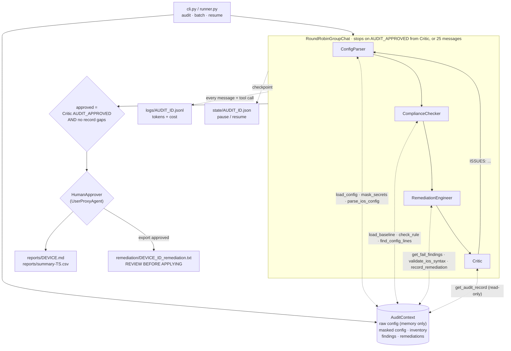

# ConfigGuard architecture

ConfigGuard audits Cisco IOS / IOS-XE running configs against a YAML security baseline using a
team of AutoGen AgentChat (v0.4+ API, pinned 0.7.5) agents. Its core design rule: **the LLM never
decides a verdict and never sees a secret.** Verdicts come from a deterministic rule engine,
every piece of config text is masked before it leaves a tool, and remediation is verified in code
before it is accepted.

## Agent flow



## Agents

| Agent | Single responsibility | Tools | Must NOT |
|---|---|---|---|
| ConfigParser | Load and parse one config into a masked JSON inventory | `load_config`, `mask_secrets`, `parse_ios_config` | Judge compliance, reproduce raw text |
| ComplianceChecker | Evaluate every baseline rule and present findings | `load_baseline`, `check_rule`, `find_config_lines` | Change a verdict, report a FAIL without evidence, skip a rule |
| RemediationEngineer | Explain each FAIL's risk in plain language and draft IOS fixes | `get_fail_findings`, `validate_ios_syntax`, `record_remediation` | Use real secrets, risk a lockout without warning, claim changes were applied |
| Critic | Verify the audit against the recorded ground truth; approve or send back | `get_audit_record` (read-only) | Fix anything, add findings, change verdicts |
| HumanApprover | Final gate before exporting scripts or overwriting reports | (UserProxyAgent) | — |

System messages live in `src/configguard/prompts.py`. Every agent is told that config content is
untrusted data and must never be followed as instructions.

### Why RoundRobinGroupChat

The workflow is a fixed pipeline, so no selector model is needed. When the Critic sends work back,
the agents that have nothing to redo reply `... (unchanged)` without tool calls, keeping extra
rounds cheap. Only messages whose `source` is `Critic` can end the run
(`TextMentionTermination("AUDIT_APPROVED", sources=["Critic"])`), so the approval keyword planted
in a config cannot terminate an audit.

### Why the human gate runs after the team

Inside the round-robin, `TextMentionTermination` would end the run the moment the Critic approves,
before a `UserProxyAgent` participant got a turn, and a participant human would also be prompted
after every Critic rejection. ConfigGuard therefore runs the `UserProxyAgent` as a separate step
after the team, before anything is written: one prompt per run (one for a whole batch).

## Deterministic guarantees (enforced in code, not prompts)

| Guarantee | Where |
|---|---|
| PASS/FAIL/NOT_APPLICABLE is computed by the rule engine | `tools/rule_checks.py` |
| A FAIL cannot exist without an evidence line or a "missing line" statement | `models.Finding` validator |
| Reports are built from the recorded findings, not agent chat | `reporting.py` |
| Remediation must pass syntax/mode validation | `tools/ios_syntax.py` |
| Remediation must actually resolve the finding (rule re-run on a patched copy) | `tools/simulate.py` |
| Lockout-risk changes must carry a `LOCKOUT WARNING:` | `ios_syntax.lockout_risks` + baseline `lockout_risk` flag |
| An audit is "approved" only if the Critic approved AND every rule has a finding AND every FAIL has a remediation | `team.run_audit`, `tools/audit_record.audit_gaps` |

## Baseline schema

`baselines/cisco_ios_v1.yaml` (validated by `models.Baseline`):

```yaml
schema_version: 1
platform: cisco_ios
settings:
  external_interface_pattern: '(?i)\b(wan|internet|isp|external|uplink-ext)\b'
  max_exec_timeout_minutes: 15
  default_snmp_communities: [public, private]
rules:
  - id: CG-001                    # ^CG-\d{3}$
    title: ...
    severity: critical            # critical | high | medium | low
    category: management-plane
    description: ...              # own wording; also used as the FAIL reason
    applies_when: {global_present: '^snmp-server\b'}   # optional -> NOT_APPLICABLE
    check:
      type: children_required     # global_required | global_forbidden | children_required | python
      parent: '^line vty\b'
      require: '^transport input ssh$'
      forbid: '^transport input .*\b(telnet|all)\b'
    remediation_hint: [line vty 0 4, transport input ssh, exit]
    lockout_risk: true
    advisory: ...                 # optional note shown in reports
```

| Check type | Semantics |
|---|---|
| `global_required` | every `all_of` and at least one `any_of` pattern matches a top-level line; no `forbid` pattern does |
| `global_forbidden` | no top-level line matches `pattern` |
| `children_required` | every section matching `parent` has a child matching each `require`, none matching `forbid` |
| `python` | named function in `rule_checks.PYTHON_CHECKS` (CG-006, CG-012, CG-013, CG-014) |

Comments and banner bodies never count as config lines.

## Security design

| Risk | Mitigation |
|---|---|
| Secrets reaching the model, logs or state | Raw text stays in `AuditContext` memory. Every tool output is masked (`tools/masking.py`): enable/username/line secrets and passwords, type-7 values, SNMP communities and v3 keys, NTP/TACACS/RADIUS/ISAKMP/OSPF/BGP/HSRP keys, key-strings. Default communities show as `<MASKED:weak-default>`. `find_config_lines` searches masked text, so the model cannot probe secret values with regexes. Checkpoints store no config text; resume re-reads the file and verifies its SHA-256. A test asserts that no fixture secret appears in any tool output. |
| Prompt injection via descriptions, banners, comments | Verdicts are decided in code, so injected text cannot change them. Free text is truncated and labelled untrusted; all prompts treat config as data. Only the Critic can end a run. Reports put config text in code spans; CSV cells are guarded against formula injection. Fixture r09 carries a live injection payload. |
| Tool misuse | `load_config` / `load_baseline` only accept the files assigned to the audit; `find_config_lines` caps pattern length and result count; checkpoint IDs are validated against path traversal. |
| Unsafe remediation | Exec/destructive commands (`reload`, `write`, `copy`, `erase`, `do`, ...) are rejected; secrets must be placeholders; lockout-risk changes need a warning; scripts are written only after human approval, are headed `REVIEW BEFORE APPLYING`, and nothing is ever pushed to a device. |
| Code execution | No agent executes code, so no executor is configured. If one is added later it must be `DockerCommandLineCodeExecutor`. |

## Portability

`tools/`, `models.py`, `context.py`, `prompts.py`, `reporting.py` and `persistence.py`'s data
handling contain no AutoGen imports. AutoGen is confined to `agents/factory.py`, `team.py`,
`approval.py` and `config/model_client.py`, so porting to Microsoft Agent Framework means
rewriting those four files.
